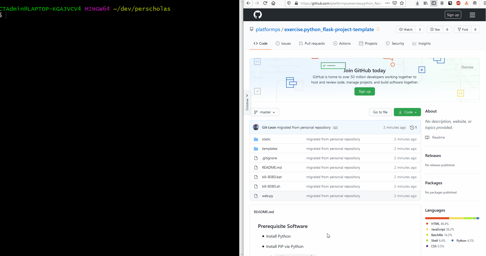

# SBA Kubernetes Two-Container Cluster
* **Objective** - Clone and modify this repository locally to ensure that Jenkins can successfully build this project.
* **Purpose** - To demonstrate continuous integration skillset

## Prerequisite Software For Project
* Install Git CLI
* Install Docker
* Install `minikube`
* Install `kubectl`
* Install Kontena Lens
* Install Python
   * Install PiP via Python
      * `python -m ensurepip`
   * Install `Flask`
      * `python -m pip install Flask`

## Instructions
* Fork and clone this project locally.
* Create a respective `requirements.txt` to download any `pip` dependencies for this python project.
  * Ensure you `push` the newly created file: `requirements.txt`
* Create a `Dockerfile` which runs the application upon running the container.
  * Ensure you `push` the newly created file: `Dockerfile`
* Configure a Kubernetes cluster to build and run two instance of the container aforementioned container.
  * Ensure each application is accessible on a different port.
  * Ensure you `push` the newly created file: `kubeconfig`

### How to Download

#### Part 1 - Forking the Project
* To _fork_ the project, click the `Fork` button located at the top right of the project.

#### Part 2 - Navigating to _forked_ Repository
* Navigate to your github profile to find the _newly forked repository_.
* Copy the URL of the project to the clipboard.

#### Part 3 - Cloning _forked_ repository
* Clone the repository from **your account** into the `~/dev` directory.
  * if you do not have a `~/dev` directory, make one by executing the following command:
    * `mkdir ~/dev`
  * navigate to the `~/dev` directory by executing the following command:
    * `cd ~/dev`
  * clone the project by executing the following command:
    * `git clone https://github.com/MYUSERNAME/NAMEOFPROJECT`

## How to run this
* Upon executing `python web.py`, navigate to `localhost:8080` to view the webpage.

## How to Submit

#### Part 1 -  _Pushing_ local changes to remote repository
* from a _terminal_ navigate to the root directory of the _cloned_ project.
* from the root directory of the project, execute the following commands:
    * add all changes
      * `git add .`
    * commit changes to be pushed
      * `git commit -m 'I have added changes'`
    * push changes to your repository
      * `git push -u origin master`

#### Part 2 - Submitting assignment
* from the browser, navigate to the _forked_ project from **your** github account.
* click the `Pull Requests` tab.
* select `New Pull Request`
